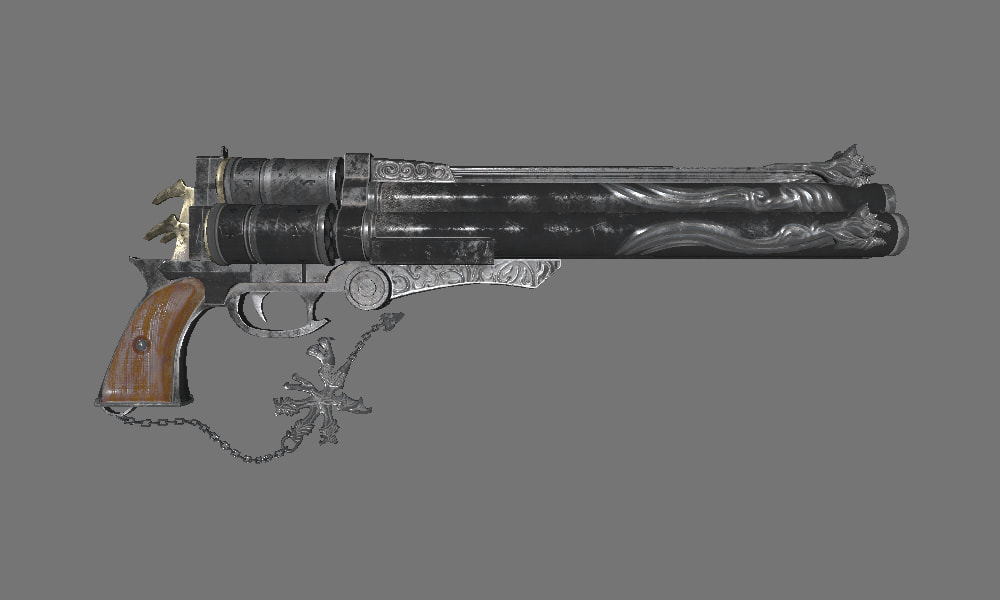

# WebGPU demo in D
A minimal WebGPU-based render engine that can load and display textured and shaded OBJ files. Uses [bindbc-wgpu](https://github.com/gecko0307/bindbc-wgpu) to load WebGPU functions and SDL2 to create a window. Written in [D language](https://dlang.org).

The demo renders a Cerberus model by Andrew Maximov.

**Warning: highly experimental!** I've tested it on Windows and Linux so far. It probably should work on macOS, however has not been tested yet.

To run the application, you should install [SDL2](https://www.libsdl.org) and [wgpu-native 22.1](https://github.com/gfx-rs/wgpu-native). Under Windows, `SDL2.dll` and `wgpu_native.dll` can be copied to the application directory.

### What is WebGPU?
It is a new low-level graphics and compute API for the Web that works on top of Vulkan, DirectX 12, or Metal. It exposes the generic computational facilities available in today's GPUs in a cross-platform way.

[wgpu-native](https://github.com/gfx-rs/wgpu-native) is a native WebGPU implementation in Rust that compiles to a library with C API, which can be used in any language. This potentially makes WebGPU a viable and future-proof alternative to OpenGL for cross-platform graphics development.

### Is this going to be a full-blown game engine?
Probably. Let's wait for API to stabilize first.
